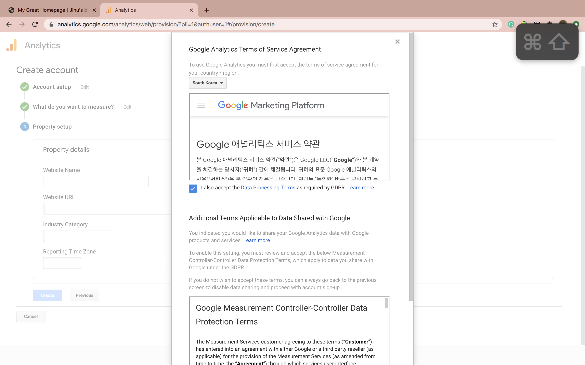
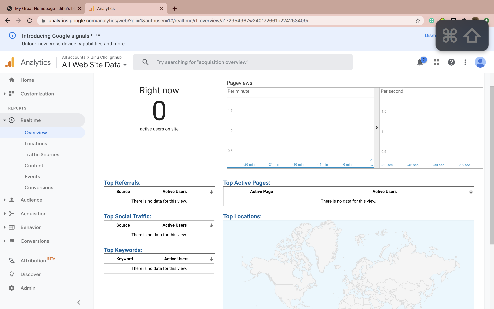

What is Google Analytics? 구글 애널리틱스란?  
  
구글 애널리틱스는 웹사이트 방문자의 데이터를 수집해서 분석함으로써 온라인 비즈니스의 성과를 측정하고 개선하는 데 사용하는 웹로그분석 도구입니다.  
  
구글은 2005년 3월 웹분석 전문 업체인 어친 소프트웨어(Urchin Software)를 인수한 후 그해 11월 구글 애널리틱스 서비스를 출시했습니다. 무료 서비스임에도 매우 강력한 기능을 제공함으로써 지금은 전세계적으로 가장 널리 사용되는 웹분석 툴이 되었습니다.  
  
사용법:  
- https://analytics.google.com/ 웹사이트에 들어가서 계정을 만든다.
- 자신의 tracking id를 코드에 넣는다
- 이제 구글 애널리틱스 웹사이트에 들어가서 실행

